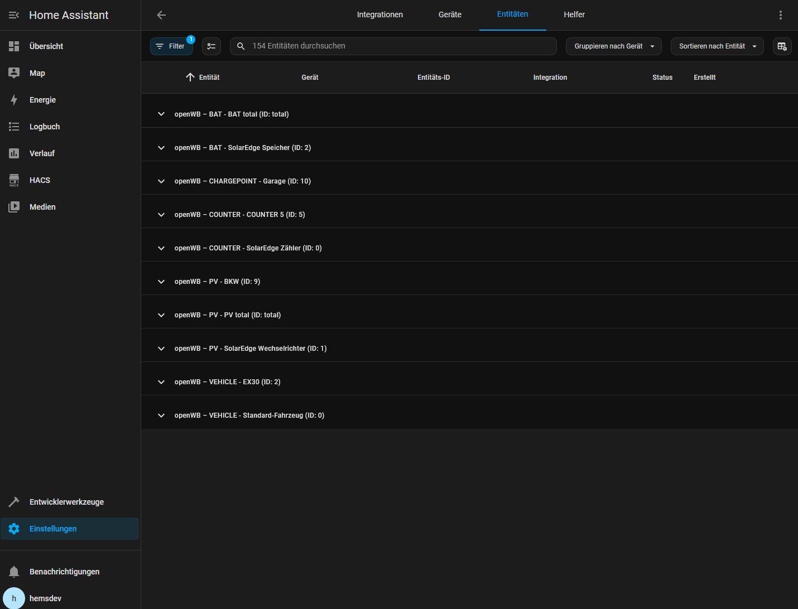
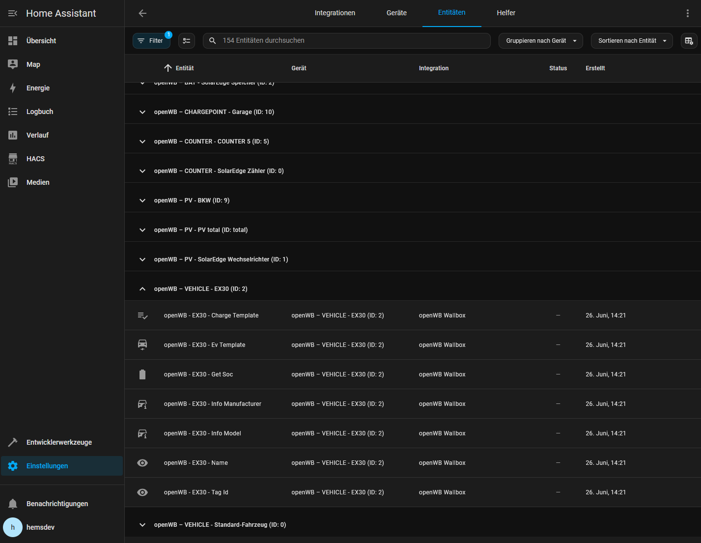
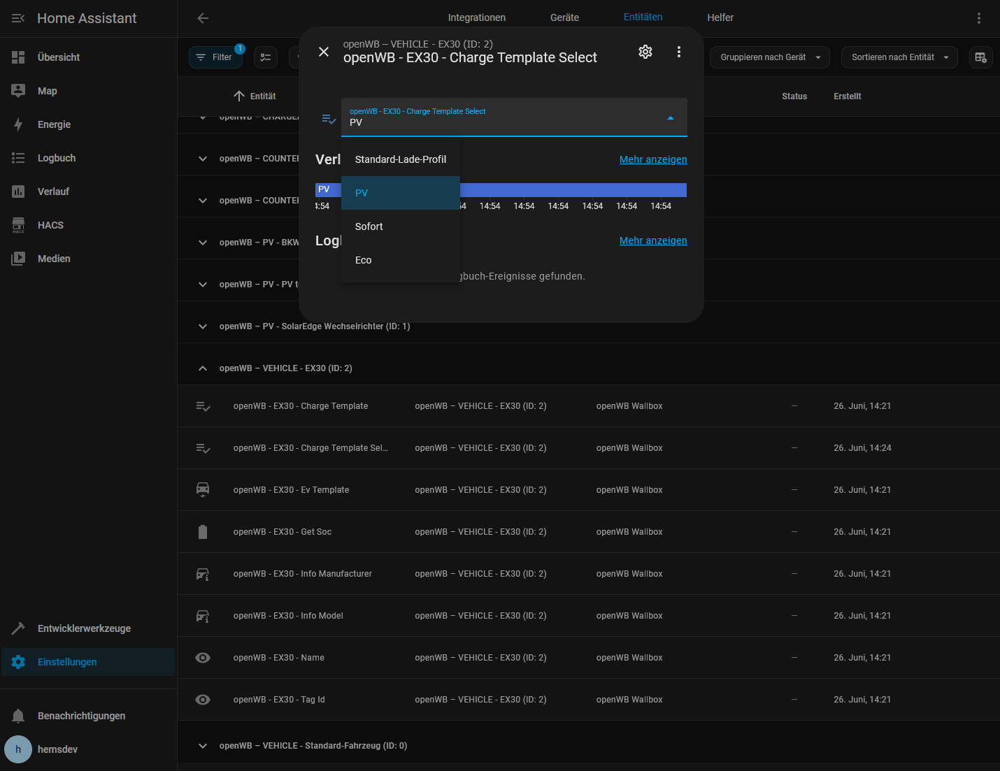

# openWB Home Assistant Integration - ENGLISH

This Home Assistant custom integration seamlessly connects your openWB charging station to your smart home via MQTT. It automatically reads all relevant MQTT data and creates matching sensors – including data for wallbox, vehicles, battery, and photovoltaic system (PV).

## 📚 Table of Contents

- [ENGLISH Documentation](#openwb-home-assistant-integration---english)
  - [🔧 Features](#-features)
    - [✅ Automatic MQTT Discovery](#-automatic-mqtt-discovery)
    - [⚡ Supported Device Categories](#-supported-device-categories)
    - [🧠 Template Names](#-template-names)
    - [🎚️ Select Entity for Charge Template](#️-select-entity-for-charge-template)
  - [🛣️ Roadmap](#️-roadmap)
  - [🔗 Requirements: MQTT integration](#-requirements-mqtt-integration)
  - [🧩 Installation via HACS](#-installation-via-hacs)
  - [🔧 Charging Template - HASS YAML Generator ](#home-assistant-yaml-generator)

- [GERMAN Documentation](#openwb-home-assistant-integration---german)
  - [🔧 Funktionen](#-funktionen)
    - [✅ Automatische MQTT-Erkennung](#-automatische-mqtt-erkennung)
    - [⚡ Unterstützte Gerätegruppen](#-unterstützte-gerätegruppen)
    - [🧠 Template-Namen](#-template-namen)
    - [🎚️ Auswahl-Entität für Charge Template](#️-auswahl-entität-für-charge-template)
  - [🛣️ Roadmap](#️-roadmap-1)
  - [🔗 Anforderungen: MQTT-Integration](#-anforderungen-mqtt-integration)
  - [🧩 Installation über HACS](#-installation-über-hacs)
  - [🔧 Charging Template - HASS YAML Generator ](#home-assistant-yaml-generator-1 )

- [📸 Screenshots](#-screenshots)

---

## 🔧 Features

### ✅ Automatic MQTT Discovery

- Subscribes to all `openWB/#` topics via MQTT.
- Automatically detects new devices and values.
- Creates matching entities (sensors) on-the-fly.

---

### ⚡ Supported Device Categories

| Category          | Example Topic                        | Description                              |
|-------------------|---------------------------------------|------------------------------------------|
| **Charge Points** | `openWB/chargepoint/0/#`              | Status, configuration, phases, etc.      |
| **Vehicles**      | `openWB/vehicle/0/#`                 | SoC, template, info, etc.                |
| **Battery**       | `openWB/bat/0/#`                     | Charging power, SoC, current, etc.       |
| **PV System**     | `openWB/pv/0/#`                      | Generation, voltages, error messages     |
| **Summaries**     | `openWB/bat/get/`, `openWB/pv/get/`  | Total power, energy, etc.                |
| **Meter Data**    | `openWB/counter/0/#`                 | Import/export, power, frequency, etc.    |

---

### 🧠 Template Names

- Automatically loads names for `charge_template` and `ev_template` from the following topics:
  - `openWB/vehicle/template/charge_template/<id>`
  - `openWB/vehicle/template/ev_template/<id>`

These templates are displayed as human-readable text (e.g., `Fast Charge`, `Overnight Slow`).

---

### 🎚️ Select Entity for Charge Template

- The integration automatically creates a `select` entity for each detected vehicle.
- This select entity allows switching between available `charge_template` profiles in openWB directly from the Home Assistant UI.

---

## 🛣️ Roadmap

- [x] Automatic detection of MQTT topics (`openWB/#`)
- [x] Dynamic creation of sensor entities
- [x] Support for vehicle templates (`charge_template`, `ev_template`)
- [x] Chargepoint configuration mapped to individual entities
- [x] Select entities for choosing charge templates
- [x] Device naming according to openWB configuration
- [x] Implement full control of openWB charge_template

### Planned:
- [ ] Extended control of openWB via `set/` topics
- [ ] Automated charging planning using PV/SoC forecasts
- [ ] Multilingual UI (DE/EN)
- [ ] Provide Lovelace Dashboard(s)

---

### 🔗 Requirements: MQTT integration

This integration requires the official [MQTT integration](https://www.home-assistant.io/integrations/mqtt/) to be installed and configured.
The openWB topics must also be transferred to this instance. Either via MQTT bridge from openWB or via a customized configuration of Mosquitto, for example.

To enable MQTT:

1. Go to **Settings → Devices & Services**
2. Click on **„+ Add Integration“**
3. Search for **MQTT** and follow the setup wizard

Example Mosquitto Bridge Config (not openWB MQTT Bridge) to subscribe all openWB/# topics
```
    #################################################################
    # MQTT Bridge to openWB
    #################################################################

    connection openwb-bridge
    address 10.10.10.85:1883
    clientid mosquitto-openwb-bridge
    try_private false
    cleansession true
    start_type automatic

    # Optional user/password
    # username openwbuser
    # password geheim

    topic openWB/# in 2
    topic openWB/set/# out 2
```

## 🧩 Installation via HACS

This integration can be installed and updated easily using [HACS](https://hacs.xyz/):

### 📦 Step-by-step instructions

1. **Open HACS** in your Home Assistant UI  
   → Go to **HACS → Integrations**

2. Click on **„+ Explore & Download Repositories“**

3. In the top right, click on **„⋮ → Custom repositories“**

4. Enter the URL of this repository:  https://github.com/mkshb/openwb_hass and choose **„Integration“** as category

5. Click **Add**

6. The integration will now appear in the list. Click on it and select **Install**.

7. **Restart Home Assistant**

8. Go to **Settings → Devices & Services → Add Integration**, search for **„openWB“** and follow the setup wizard.

---

## Home Assistant YAML Generator

Easy generating Home Assistant dashboard elements

📥 [Download index.html](./yamlgenerator/index.html)

→ Download file
 → Open in local browser
 → Enter ID and the name of the loading profile
 → Click “Generate”
  
→ Insert in Home Assistant via 
 → Edit dashboard
 → In a section: Edit
 → Click on the three dots at the top right
 → Edit in YAML
 → Insert code from the generator (replacing everything)

---
---

# openWB Home Assistant Integration - GERMAN

Diese Home Assistant Custom Integration bindet eine openWB-Ladestation über MQTT nahtlos in dein Smart Home ein. Sie liest automatisch alle relevanten MQTT-Daten aus und erstellt daraus passende Sensoren – inklusive Wallbox-, Fahrzeug-, Batterie- und PV-Daten.

---

## 🔧 Funktionen

### ✅ Automatische MQTT-Erkennung

- Abonniert alle `openWB/#`-Topics per MQTT.
- Erkennt automatisch neue Geräte und Werte.
- Erstellt passende Entitäten (Sensoren) on-the-fly.

---

### ⚡ Unterstützte Gerätegruppen

| Gerätegruppe | Beispiel-Topic                        | Beschreibung                             |
|--------------|----------------------------------------|------------------------------------------|
| **Ladepunkte**   | `openWB/chargepoint/0/#`             | Status, Konfiguration, Phasen etc.       |
| **Fahrzeuge**    | `openWB/vehicle/0/#`                | SoC, Template, Info, etc.                |
| **Batterie**     | `openWB/bat/0/#`                    | Ladeleistung, SoC, Strom etc.            |
| **PV-Anlage**    | `openWB/pv/0/#`                     | Erzeugung, Spannungen, Fehlertexte       |
| **Summenwerte**  | `openWB/bat/get/`, `openWB/pv/get/` | Gesamtleistung, Energie etc.             |
| **Zählerdaten**  | `openWB/counter/0/#`                | Import/Export, Leistung, Frequenz etc.   |

---

### 🧠 Template-Namen

- Lädt automatisch die Namen für `charge_template` und `ev_template` aus den Topics:
  - `openWB/vehicle/template/charge_template/<id>`
  - `openWB/vehicle/template/ev_template/<id>`

Diese Vorlagen werden korrekt als lesbarer Text angezeigt (z. B. `Schnellladen`, `Langsam über Nacht`).

### 🎚️ Auswahl-Entität für Charge Template

- Die Integration erstellt automatisch eine `select`-Entität für jedes erkannte Fahrzeug.
- Diese Entität erlaubt es, das aktuell verwendete `charge_template`-Profil direkt über die Home Assistant-Oberfläche umzuschalten.

---

## 🛣️ Roadmap

- [x] Automatische Erkennung von MQTT-Topics (`openWB/#`)
- [x] Dynamische Erstellung von Sensoren
- [x] Unterstützung für Fahrzeug-Templates (`charge_template`, `ev_template`)
- [x] Ladepunkt-Konfiguration als Entitäten
- [x] Select-Entitäten für Ladeprofile
- [x] Benennung von Home Assistant Geräten nach openWB Konfiguration
- [x] openWB charge_template aus Home Assistant heraus anpassen

### Geplant:
- [ ] Weitere Steuerung von openWB via `set/`-Topics
- [ ] Automatisierte Ladeplanung mit PV-/SoC-Prognosen
- [ ] Mehrsprachige Oberfläche (DE/EN)
- [ ] Lovelace Dashboard(s) bereitstellen

---

## 🔗 Anforderungen: MQTT-Integration

Für diese Integration muss die offizielle [MQTT-Integration] (https://www.home-assistant.io/integrations/mqtt/) installiert und konfiguriert sein.
Die openWB-Themen müssen ebenfalls in diese Instanz übertragen werden. Entweder über die MQTT-Bridge von openWB oder über eine angepasste Konfiguration von z.B. Mosquitto.

So aktivieren Sie MQTT:

1. Gehen Sie zu **Einstellungen → Geräte & Dienste**
2. Klicken Sie auf **„+ Integration hinzufügen “**.
3. Suchen Sie nach **MQTT** und folgen Sie dem Einrichtungsassistenten

Beispiel Mosquitto Bridge Config (nicht openWB MQTT Bridge) um alle openWB/# Topics zu abonnieren
```
    #################################################################
    # MQTT Bridge to openWB
    #################################################################

    connection openwb-bridge
    address 10.10.10.85:1883
    clientid mosquitto-openwb-bridge
    try_private false
    cleansession true
    start_type automatic

    ## Optional: Benutzer / Passwort
    # username openwbuser
    # password geheim

    topic openWB/# in 2
    topic openWB/set/# out 2
```

---

## 🧩 Installation über HACS

Diese Integration kann ganz einfach über [HACS](https://hacs.xyz/) installiert und aktualisiert werden:

### 📦 Schritt-für-Schritt-Anleitung

1. **Öffne HACS** in der Home Assistant-Oberfläche  
   → Gehe zu **HACS → Integrationen**

2. Klicke auf **„+ Durchsuchen & Repositories herunterladen“**

3. Klicke oben rechts auf **„⋮ → Benutzerdefinierte Repositories“**

4. Gib folgende Repository-URL ein:  https://github.com/mkshb/openwb_hass und wähle **„Integration“** als Kategorie

5. Klicke auf **Hinzufügen**

6. Die Integration erscheint nun in der Liste. Klicke darauf und wähle **Installieren**

7. **Starte Home Assistant neu**

8. Gehe zu **Einstellungen → Geräte & Dienste → Integration hinzufügen**, suche nach **„openWB“** und folge dem Einrichtungsassistenten.
---

## Home Assistant YAML Generator

Einfaches Generieren von Home Assistant Dashboard-Elementen.

📥 [Download index.html](./yamlgenerator/index.html)

→ Datei herunterladen
  → Im lokalen Browser öffen
  → ID und den Namen des Ladeprofils eingeben
  → „Generieren“ klicken

→ Einfügen in Home Assistant über 
  → Dashboard bearbeiten
  → In einem Abschnitt: Bearbeiten
  → Klick auf die drei Punkte oben rechts
  → In YAML bearbeiten
  → Code aus dem Generator einfügen (dabei alles ersetzen)


---

# Screenshots




